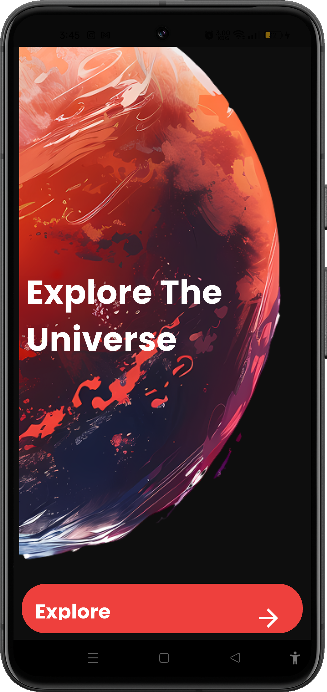
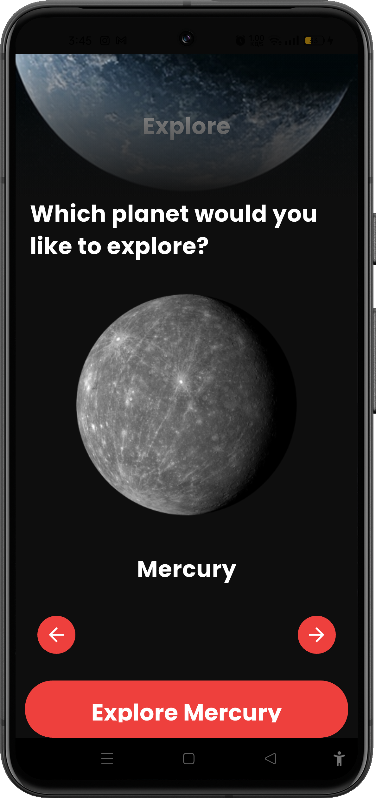
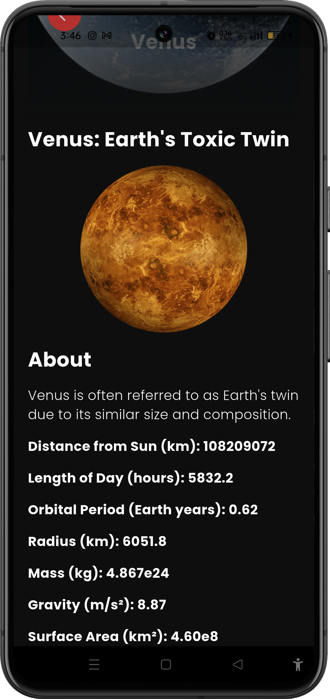

# 🚀 Space App

<p align="center">
  
</p>

## 🌌 Overview

**Space App** is a beautifully crafted Flutter application that lets you journey through our solar system. From the scorching surface of Mercury to the icy depths of Neptune, explore every planet (and the Sun!) with rich details, stunning visuals, and an immersive dark-themed UI.

---

## ✨ Features

- 🪐 **Browse all 9 celestial bodies** — Mercury, Venus, Earth, Mars, Jupiter, Saturn, Uranus, Neptune & the Sun
- 🔭 **Detailed planet profiles** — distance from the Sun, radius, mass, gravity, orbital period, day length, and surface area
- 🎨 **Sleek dark UI** — space-inspired color palette with smooth page transitions
- 🖼️ **Intro splash screen** — cinematic entry point to the universe
- ➡️ **PageView navigation** — swipe or use arrow buttons to browse planets
- 📄 **Detail screen** — deep-dive into each planet's stats and description

---

## 🛠 Tech Stack

| Technology | Purpose |
|---|---|
| **Flutter** | Cross-platform UI framework |
| **Dart** | Programming language |
| **Google Fonts** | Custom typography |

---

## 📸 Screenshots

<p align="center">
  
  &nbsp;&nbsp;
  
  &nbsp;&nbsp;
  
</p>

<p align="center">
  
  &nbsp;&nbsp;
  
</p>

---

## ▶️ How to Run

1. **Clone the repository**
   ```bash
   git clone https://github.com/fatmanagaa/space_app.git
   cd space_app
   ```

2. **Install dependencies**
   ```bash
   flutter pub get
   ```

3. **Run the app**
   ```bash
   flutter run
   ```

> Requires Flutter SDK `^3.10.1` and Dart SDK `^3.10.1`

---

## 📂 Project Structure

```
lib/
├── main.dart                  # App entry point & routing
├── core/
│   ├── app_assets.dart        # Asset path constants
│   ├── app_colors.dart        # Color palette
│   ├── app_routes.dart        # Named route definitions
│   ├── app_styles.dart        # Text styles
│   └── app_theme.dart         # Dark theme configuration
├── model/
│   ├── planet_model.dart      # Planet list model
│   └── planet_details_model.dart  # Planet detail model
└── screens/
    ├── intro/                 # Splash / intro screen
    ├── Home/                  # Planet browsing screen
    └── details/               # Planet detail screen & data
assets/
├── images/                    # Planet & background images
└── screenshots/               # App screenshots


- [Lab: Write your first Flutter app](https://docs.flutter.dev/get-started/codelab)
- [Cookbook: Useful Flutter samples](https://docs.flutter.dev/cookbook)

For help getting started with Flutter development, view the
[online documentation](https://docs.flutter.dev/), which offers tutorials,
samples, guidance on mobile development, and a full API reference.
